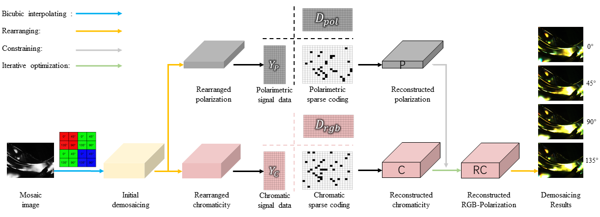

# A Sparse Representation Based Joint Demosaicing Method for Single-Chip Polarized Color Sensor


 Our paper is accepted by **IEEE Transactions on Image Processing (TIP)**. 

<div align=center>   </div>

**Picture:**  *The iterative optimization framework with learned dictionaries.*


<div align=center>   </div>

**Picture:**  *Experiment results in the real scene.*


This repository contains the official MATLAB implementation of the following paper:

> **A Sparse Representation Based Joint Demosaicing Method for Single-Chip Polarized Color Sensor**<br>
>  Sijia Wen, Yinqiang Zheng, Feng Lu <br> https://ieeexplore.ieee.org/abstract/document/9397396
> 
>**Abstract:**  The emergence of the single-chip polarized color sensor now allows for simultaneously capturing chromatic and polarimetric information of the scene on a monochromatic image plane. However, unlike the usual camera with an embedded demosaicing method, the latest polarized color camera is not delivered with an in-built demosaicing tool. For demosaicing, the users have to down-sample the captured images or to use traditional interpolation techniques. Neither of them can perform well since the polarization and color are interdependent. Therefore, joint chromatic and polarimetric demosaicing is the key to obtaining high-quality polarized color images. In this paper, we propose a joint chromatic and polarimetric demosaicing model to address this challenging problem. Instead of mechanically demosaicing for the multi-channel polarized color image, we further present a sparse representation-based optimization strategy that utilizes chromatic information and polarimetric information to jointly optimize the model. To avoid the interaction between color and polarization during demosaicing, we separately construct the corresponding dictionaries. We also build an optical data acquisition system to collect a dataset, which contains various sources of polarization, such as illumination, reflectance and birefringence. Results of both qualitative and quantitative experiments have shown that our method is capable of faithfully recovering full RGB information of four polarization angles for each pixel from a single mosaic input image. Moreover, the proposed method can perform well not only on the synthetic data but the real captured data. 

## Resources

Material related to our paper is available via the following links:

- Paper:  https://ieeexplore.ieee.org/abstract/document/9397396
- Code: https://github.com/wsj890411/JCPD_Model

## System requirements

* MATLAB 2018b

## Dataset

Download (Dropbox):  https://www.dropbox.com/s/q377c1iktxwe22a/TIP_raw_dataset.zip?dl=0

Download (BaiduPan):  https://pan.baidu.com/s/1l3a1pjFnEUASFnmJjc6-LA Code: 01tx

## Citation

If you find this work or code is helpful in your research, please cite:

```latex
@article{wen2021sparse,
  title={A Sparse Representation Based Joint Demosaicing Method for Single-Chip Polarized Color Sensor},
  author={Wen, Sijia and Zheng, Yinqiang and Lu, Feng},
  journal={IEEE Transactions on Image Processing},
  volume={30},
  pages={4171--4182},
  year={2021},
  publisher={IEEE}
}
```


